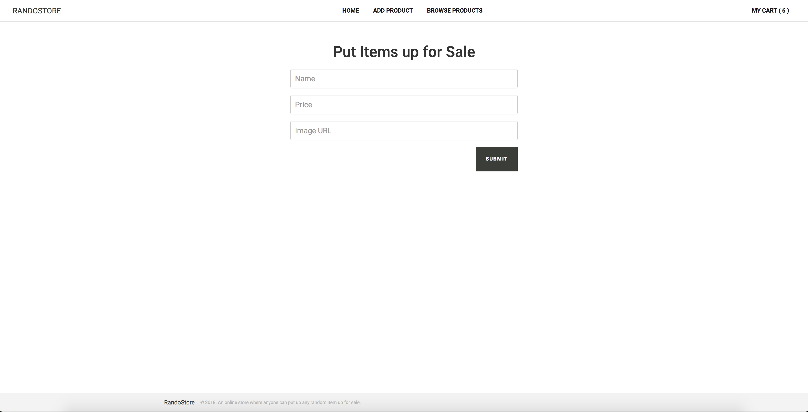

Meddy Frontend Code Challenge
=======================

RandoStore is an online store where anyone can put up any random item up for sale and anyone else can buy it.

## Instructions

Download or clone the repository.
```bash
git clone https://github.com/jkdamilola/frontend-code-challenge.git
```

After cloning the repository, navigate to the repository directory and install the necessary dependencies:
```bash
cd frontend-code-challenge
npm install
```

To start the app, run on *project-root* folder via the terminal.
```bash
npm start
```

It creates two folders named *build* and *dist* in the root directory. The *build* directory contains the unminified version of the JavaScript files for easy debugging during development while the *dist* contains the minified version ready for production.

# Implementation Explanation

## Dependencies
- Front-end: **ES6, AngularJS, Angular UI Router**
- Asynchronous communication: **AngularJS $http Module**
- Database: **LocalStorage**
- Back-end: **Node.js**
- Build Tools: **Gulp, Babel, Browserify**


## Home Page

It allows you to navigate to the last three pages


## Add New Item Page
It allows you to add new items to the store.



## Browse Item Page
It allows you view all the items you can add to your cart.


## Checkout Page
It allows you view all the items that you've checked out.


# Time Logs

- **Gathered necessary requirements** - 1 hour
- **Designed RandoStore UI** - 2 hours
- **Implemented RandoStore Logic** - 6 hours
